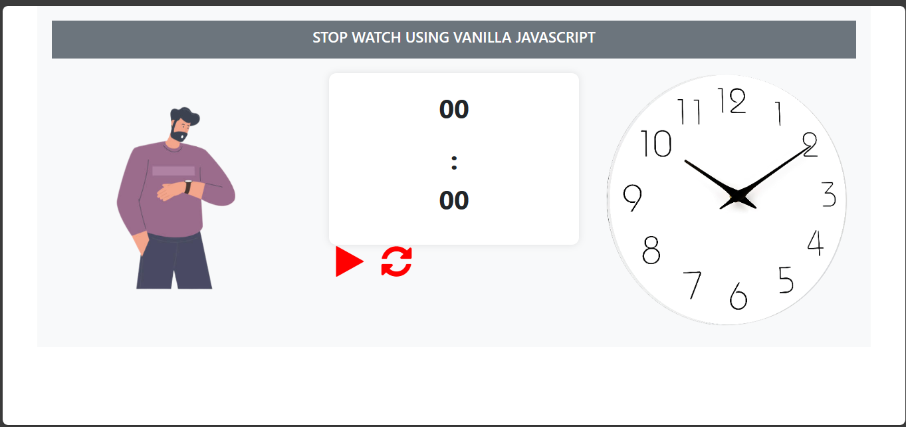
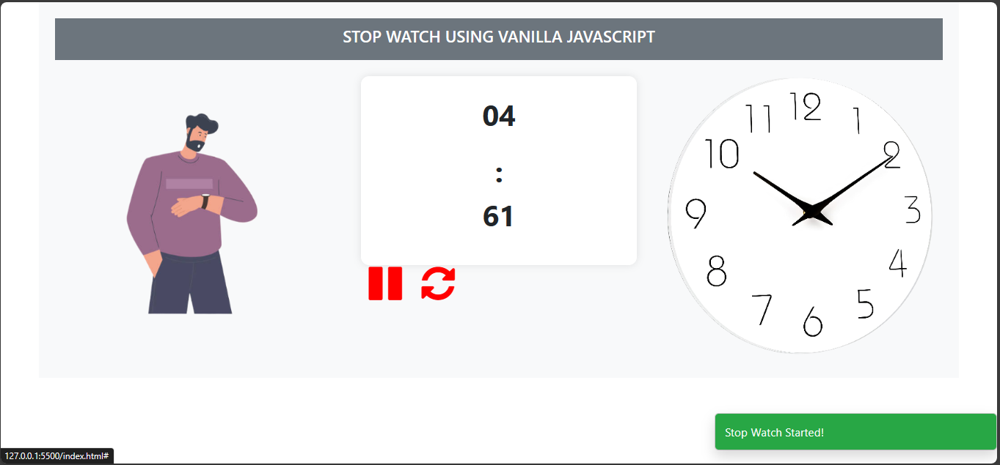
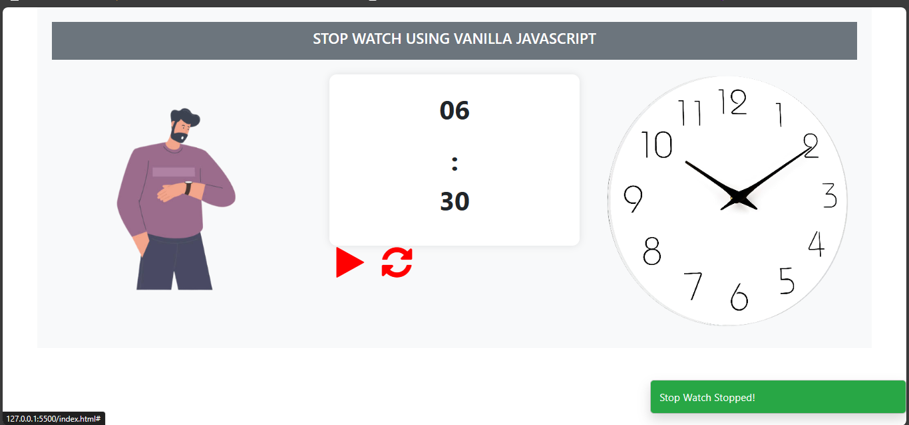
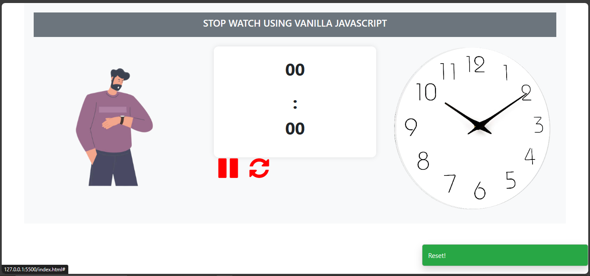

# Stopwatch Web App

A simple web app to demonstrate a stopwatch using vanilla JavaScript and Bootstrap.

## Features

- Start, pause, and reset the stopwatch.
- Background image opacity adjustment.
- Toast notification when the stopwatch is started.

## Screenshots

Include screenshots of your web app here if relevant.

## Image when intially project loads


## Image when click on Play Button


## Image when click on Pause Button


## Image when click on Reset Button


## Technologies Used

- HTML5
- CSS3
- Bootstrap 5
- JavaScript

## How to Use

1. Clone the repository:

   ```bash
   git clone https://github.com/GEDDA-star/Stop-Watch.git
